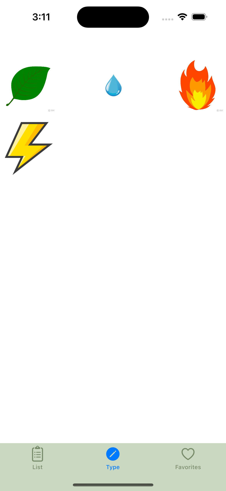
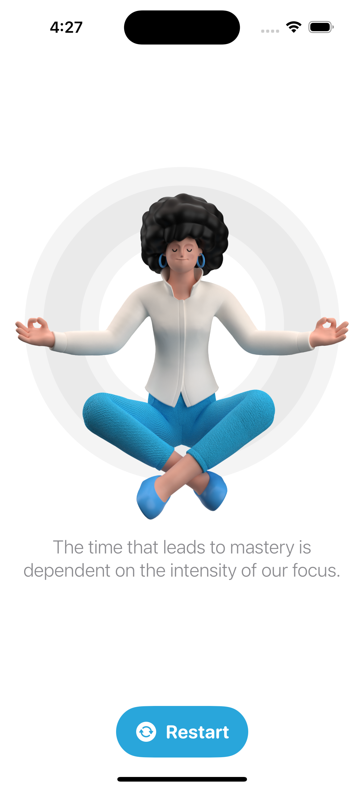

# Aplicación piedra papel o tijera 

  
  
  
  
  
  

# Aplicación Pokemones 

Usando UserDefaults TableView CollectionView

  
  
  
  

# Aplicación Netflix

TableView CollectionView deslizamiento horizontal y vertical

  

# Aplicación restart swiftUI

Animaciones barra y navegación

  
  

# Aplicacion Fructus swiftUI 

  
  
  
  
  
  
  
  
  

# Aplicación FlashChat

Animaciones barra y navegación

  
    
  
  
    

# Collection View 

Usando dependencia https://github.com/AfrazCodes/CHTCollectionViewWaterfallLayout para ajustar las imagenes 

  

